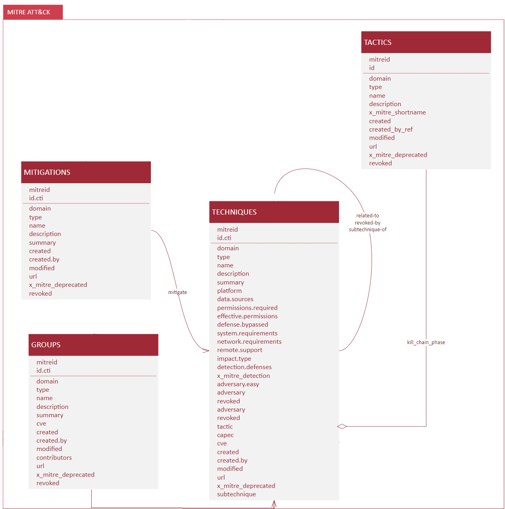

```{r setup, include=FALSE}
knitr::opts_chunk$set(echo = TRUE)
```

# Introducción

Como miembro del equipo de cybersecurity y experto en data science, se
solicita tu colaboración para el análisis de un conjunto de incidentes
de seguridad añadiendo información de contexto, que pueda ayudar a
entender que sucedió y como mejorar.

## Objetivo

El objetivo consiste en responder las siguientes preguntas:

1.  ¿Qué estandar/es podría/n añadir contexto a los incidentes?
2.  ¿Cuantos incidentes estan relacionados con phishing?
3.  ¿Quien estaba detras de los ataques?
4.  ¿Cual fue el objetivo?
5.  ¿Cómo realizaron los ataques?
6.  ¿Cómo podemos protegernos?
7.  ¿Qué podemos hacer para prevenir futuros ataques?
8.  ¿Sería posible predecir ataques?

## Alcance

Cada pregunta tiene una puntuación máxima de 2 puntos; donde se evalua
la parte análitica (1 punto) y la parte de programación (1 punto).

En total se pueden llegar a conseguir un máximo de 10 puntos.

Es posible hacer la práctica por parejas; en tal caso, los puntos
totales se dividen entre los dos alumnos, consiguiendo un máximo de 8
puntos.

# Data sets

```{r load_packages}
suppressPackageStartupMessages(library("dplyr"))
library("tidyr")
suppressPackageStartupMessages(library("DataExplorer"))
library("ggridges")
library("ggplot2")
suppressPackageStartupMessages(library("hrbrthemes"))
suppressPackageStartupMessages(library("viridis"))
```

## Incidents

Load incidents data set and unnest ATT&CK column.

```{r ds_incidents}
raw_incidents <- readRDS(file = "data/incidents.rds")
incidents <- raw_incidents %>% unnest(mitre_attack)
summary(incidents)
```

Analyze character columns to identify unique values.

```{r ds_inc_factors}
apply(incidents, 2, function(x) length(unique(x)))
```

Set character columns as factor.

```{r}
incidents <- incidents %>%
  mutate_if(is.character, as.factor)
summary(incidents)
```

```{r fig.width=8, fig.height=8}
plot_correlation(incidents)
```

Seems that Tactic and Industry values are interesting. Let's see
industry distribution along time.

```{r}
# Ref: https://www.r-graph-gallery.com/294-basic-ridgeline-plot.html

ggplot(incidents, aes(x = first_event_ts, y = industry, fill = industry)) +
  geom_density_ridges() +
  theme_ridges() + 
  theme(legend.position = "none")

```

The time series distribution is based on first event. We can calculate
the duration of the incidents using containment time.

```{r fig.width=8, fig.height=8, warning=FALSE}
# Ref: https://www.r-graph-gallery.com/320-the-basis-of-bubble-plot.html
incidents <- incidents %>% mutate(duration = round(as.numeric(containment_ts - first_event_ts)/3600, 2))

incidents %>%
  arrange(desc(first_event_ts)) %>%
  # mutate(country = factor(country, country)) %>%
  ggplot(aes(x=first_event_ts, y=industry, size=duration, fill=tactic)) +
  geom_point(alpha=0.5, shape=21, color="black") +
  scale_size(range = c(.1, 20), name="Duration") +
    scale_fill_viridis(discrete=TRUE, guide=FALSE, option="A") +
    theme_ipsum() +
    theme(legend.position="bottom") +
    ylab("Industry") +
    xlab("Incidents") +
    theme(legend.position = "none")
```

## CWE

**TODO**

```{r ds_cwe, cache=TRUE}
#source("data-raw/mitre-cwe.R")
#raw_cwes <- bind_rows(cwe.weaknesses, cwe.categories, cwe.views)
#rm(cwe.weaknesses, cwe.categories, cwe.views)
#dim(raw_cwes)
```

## CVE

**TODO**

```{r ds_cve, cache=TRUE}
#source("data-raw/nist-cve.R")
# raw_cves <- ""
```

## ATT&CK

**TODO**

```{r ds_attck}
source("data-raw/mitre-attck.R")
```

## SHIELD

**TODO**

```{r ds_shield}
# source("data-raw/mitre-shield.R")
```

## CPE

**TODO**

```{r ds_cpe}
# source("data-raw/nist-cpe.R")
```

## CAPEC

**TODO**

```{r ds_capec, warning=FALSE}
# source("data-raw/mitre-capec.R")
```

## CAR

**TODO**

```{r ds_car}
# source("data-raw/mitre-car.R")
```

# Data Model

**TODO: Actualizar y completar el modelo dejando solo aquellas
relaciones que usais en el análisis**


**MODELO ACTUALIZADO**



# Análisis

## ¿Qué estandar/es podría/n añadir contexto a los incidentes?

Mitre Att&ck. En él encontramos una gran base de conocimiento de las
principales **tácticas** y **técnicas** usadas por los atacantes en base
a datos reales. Mediante esta información, podremos ampliar el
conocimiento obtenido en el *dataset* original de incidentes. Otro valor
añadido interesante que nos puede aportar este estándar son datos sobre
los **grupos de ciber atacantes** que pueden estar detrás de nuestros
incidentes y la consciencia de **cómo podemos resolver las
vulnerabilidades** que estos atacantes han aprovechado para explotarlas.

En este apartado, usaremos el lenguaje R para obtener un conjunto de
tablas con información útil pero específica. Usaremos cada una de ellas
para resolver las distintas cuestiones planteadas.

Interpretando que las líneas repetidas son registros duplicados de un
mismo incidente (ya que coinciden en tipo de incidente, fecha, duración
y organización), inicialmente, crearemos una tabla en la que
eliminaremos las líneas repetidas y ordenaremos los incidentes
resultantes de máxima a mínima duración (para poder visualizar
fácilmente los incidentes más largos cuando echemos un vistazo visual a
la tabla).

```{r}
nrow(incidents)
duration_table <- distinct(incidents) %>% arrange(desc(duration))
nrow(duration_table)
```

Una vez tenemos los incidentes limpios de registros repetidos,
procederemos a obtener una tabla con cada tipo de información que
creemos van a aportar conocimiento útil en los puntos posteriores.

Ayudándonos de las tablas de *Mitre Att&ck*, ya tenemos la estructura
necesaria para ampliar la información de **tácticas** y **técnicas** en
sendas tablas (haremos *left join* con *attck.tactics* y
*attck.techniques* para que a las filas de *duration_table* se les
incorporen las columnas de la técnica o táctica que le corresponda). No
obstante, para extender la información sobre posibles **grupos**
atacantes (mediante la tabla *attck.groups*) y sobre las
**mitigaciones** de las vulnerabilidades usadas por los atacantes
(mediante la tabla *attck.mitigations*) de necesitamos ayudarnos de una
tabla de relaciones (*attck.relations*) mediante la que podremos,
entonces, fusionar la información de los incidentes con la de los grupos
y mitigaciones.

1.  Información sobre las **tácticas** empeladas en cada incidente.

```{r}
tactics <- left_join(duration_table, attck.tactics, by = c("tactic" = "name"))
nrow(tactics)
head (select(tactics, tactic, external_id, url, description), n = 10L)
```

2.  Información sobre las **tácticas** empeladas en cada incidente.

```{r}
techniques <- left_join(duration_table, attck.techniques, by = c("technique" = "name"))
nrow(techniques)
head (select(techniques, technique, external_id, url, description), n = 10L)
```

Comprobamos que en la tabla *techniques* hay más filas que en la *tabla
duration_table*. Eso es debido a que hay algunas técnicas (como, por
ejemplo *Spearphishing Link*) que tienen más de una subtécnicas y, con
esta fusión, obtenemos un registro para cada posible subtécnica
empleadas en nuestros incidentes. Podemos comprobarlo a continuación ya
que mostraremos los diez primeros registros de las tablas
*duration_table* y *techniques*. Si nos fijamos en la fila 10 de la
tabla *techniques*, vemos que es otra alternativa de subtécnica al
incidente también representado en la fila anterior (lo podemos verificar
fijándonos en las columnas *org* y *first_event_ts*).

```{r}
head (select(duration_table, technique, org, first_event_ts), n = 10L)
head (select(techniques, technique, external_id, org, first_event_ts), n = 10L)
```

3.  Si queremos información de las **mitigaciones / grupos** debemos
    obtener las relaciones de la tabla *techniques* creada
    anteriormente. Para ello, con una *inner join* obtendremos la fusión
    de las técnicas empleadas en nuestros incidentes y de todas las
    relaciones existentes con estas técnicas de la tabla de relaciones
    *attck.relations* (pero descartando cualquier fila de ambas tablas
    que no coincida con la condición de la *join* porque no queremos
    filas sin relación alguna).

```{r}
joined_data <- inner_join(attck.relations %>% select(from, to), techniques, by = c("to"= "id.x"))
```

4.  Para obtener las **mitigaciones** de las técnicas usadas en los
    incidentes recopilados, del resultado de la anterior *inner join*
    filtraremos sólo aquellas filas donde la columna que nos indica que
    tipo de relación es tenga la letra *M* que indica que es del tipo
    mitigación.

```{r}
mitigations <- joined_data[grep("M", joined_data$from), ] %>% arrange(desc(first_event_ts))
head (select(mitigations, from, to, first_event_ts, org, technique), n = 10L)
```

Para terminar de recopilar las columnas interesantes, nos quedará una
*left join* con la tabla *attck.mitigations* para que nuestra tabla
*mitigations* se complete con las columnas de la tabla
*attck.mitigations*.

```{r}
ncol(mitigations)
mitigations <- left_join(mitigations, attck.mitigations, by = c("from" = "external_id"))
ncol(mitigations)
```

5.  Para obtener los **grupos** de los posibles atacantes que usan las
    técnicas encontradas en los incidentes recopilados, del resultado de
    la anterior *inner join* ahora filtraremos sólo por aquellas filas
    donde la columna que nos indica que tipo de relación es tenga la
    letra *G* que indica que es del tipo grupo.

```{r}
groups <- joined_data[grep("G", joined_data$from), ] %>% arrange(desc(first_event_ts))
head (select(groups, from, to, first_event_ts, org, technique), n = 10L)
```

Para terminar de recopilar las columnas interesantes, nos quedará una
*left join* con la tabla *attck.groups* para que nuestra tabla *groups*
se complete con las columnas de la tabla *attck.groups*.

```{r}
ncol(groups)
groups <- left_join(groups, attck.groups, by = c("from" = "external_id"))
ncol(groups)
```

En este momento, se han creado un conjunto de tablas para resolver las
distintas cuestiones: \* duration_table \* tactics \* techniques \*
groups \* mitigations

## ¿Cuantos incidentes estan relacionados con phishing?

Anteriormente, se ha constatado que la técnica *Spearphishing Link*
tenía distintas subtécnicas. Con esto, se introduce la idea que para
saber si un incidente está relacionado con *phishing* puede ser una
buena idea buscar entre las técnicas. La decisión tomada es la de buscar
el texto *phishing* en cada uno de los registros de la columna
*technique* de la tabla *duration_table* con todos los incidentes
recogidos.

```{r}
phishing <- duration_table[grep("phishing", duration_table$technique), ]
nrow(phishing)
count(distinct(phishing, first_event_ts, org))
library(knitr)
library(kableExtra)
#phishing$duration = cell_spec(phishing$duration, color = ifelse(phishing$duration > 100, "red", "orange"))
kable(phishing, caption = "Incidentes relacionados con técnicas de *Phishing*") %>% kable_styling(bootstrap_options = c("striped", "hover"))
```

Para reafirmarnos de la decisión inicial de prescindir de las filas
repetidas, seguiremos el mismo procedimiento con la tabla *incidents*
que contiene todos los incidentes y, a posteriori, contaremos las filas
descartando las repetidas. Con esto se quiere confirmar que el resultado
final es el mismo.

```{r}
phishing_from_incident <- incidents[grep("phishing", incidents$technique), ]
nrow(phishing_from_incident)
count(distinct(phishing_from_incident, first_event_ts, org))
kable(phishing_from_incident, caption = "Incidentes relacionados con técnicas de *Phishing* (método 2)") %>% kable_styling(bootstrap_options = c("striped", "hover"))
```

Para obtener que técnicas de pshishing se ha utilizado, obtendremos los
distintos valores de la tabla *techniques*.

```{r}
distinct(phishing, technique)
```

Hemos encontrado **55 incidentes con la técnica Spearphishing Link**.
Además, Hemos comprobado cómo hay **55 registros y los 55 hacen
referencia a diferentes incidentes**.

A modo de resumen, crearemos una tabla en la que contabilizamos, por
industria, el número de incidentes de phishing detectados y su duración
media:

```{r}
phishing_summary <- (phishing %>% group_by(industry) %>% summarise(n = n()))
phishing_summary <- left_join(phishing_summary, phishing %>% group_by(industry) %>% summarise_at(vars(duration), funs(mean(., na.rm=TRUE))), by = c("industry" = "industry"))
kable(phishing_summary, caption = "Resumen: indicentes por industria / duración media") %>% kable_styling(bootstrap_options = c("striped", "hover"))
```

Visualizaremos estos resultados en dos gráficos:

```{r}
ggplot(phishing_summary, aes(x=industry, y=n)) +
      geom_segment( aes(x=industry, xend=industry, y=0, yend=n), color="skyblue") +
      geom_point(color="blue", size=5, alpha=0.8) +
      theme_light() +
      coord_flip() +
      scale_y_continuous(breaks=seq(0,max(phishing_summary$n),1)) +
      theme(
          panel.grid.major.y = element_blank(),
          panel.grid.minor = element_blank(),
          panel.border = element_blank(),
          axis.ticks.y = element_blank(), 
          axis.ticks.x = element_blank(), 
          axis.text.y = element_text(color="#333333", size=10), 
          axis.text.x = element_text(face="bold", color="#993333", size=10)	  
      ) + ggtitle ("Número de incidentes por industria") + 
      theme (plot.title = element_text(hjust=0.5, face="bold", color="red", lineheight=1.5))
ggplot(data=phishing_summary, aes(x=industry, y=duration, fill=industry)) + geom_bar(stat="identity") + theme(axis.text.x=element_text(angle=45,hjust=1,vjust=1)) + ggtitle ("Duración media de los incidentes por industria") + theme (plot.title = element_text(hjust=0.5, face="bold", color="red", lineheight=1.5))
```

De estos gráficos llama la atención que sólo se ha producido un
incidente relacionado con *phishing* en el sector público pero éste ha
sido exageradamente largo (en comparación con la media del resto de
sectores). No obstante, tratándose de un sólo incidente y que, en
estadística, cualquier muestra inferior a una población de 200 elementos
no se debe considerar significativa, quizá pueda considerarase un
*outlier*.

## ¿Quien estaba detras de los ataques?

La tabla **groups** contiene, para cada uno de los incidentes obtenidos,
las técnicas usadas y los grupos que es sabido que usan esas técnicas
(según *Mitre Att&ck*).

Para simplificar la gestión de los datos, empezaremos por seleccionar
las columnas que pueden resultar útiles y renombraremos algunas columnas
a nombres más simples.

```{r}
groups <- select(groups, from, first_event_ts, org, duration, tactic, technique, industry, url.y, description.y, name)
groups <- rename(groups, url = url.y)
groups <- rename(groups, description = description.y)
colnames(groups)
```

Si contabilizamos cuántos grupos son sospechosos de haber perpetrado
estos ataques (según la información obtenida gracias a *Mitre Att&ck*)
encontramos **91**.

```{r}
distinct(groups, name)
```

Seguidamente, vemos un desplegable con cada organización. Al seleccionar una organización veremos sus incidentes y los grupos sospechosos de estar implicados en cada uno de ellos.

```{r}
library(shiny)
small_groups <- format(select(groups, first_event_ts, org, name))

ui <- fluidPage(

    titlePanel("Grupos sospechosos por incidente"),

    selectInput(inputId = "org", label = strong("Organización"),
                  choices = unique(small_groups$org),
                  selected = "Travel"),
    selectInput(inputId = "event", label = strong("Evento"),
                  choices = "",
                  selected = ""),
        mainPanel(
            tableOutput("table1")
        )
)

server <- function(session, input, output) {
  observeEvent(input$org, updateSelectInput(session, "event", "event", choices = unique(select(subset(small_groups, org == input$org), first_event_ts)), selected = ""))
  
    plots.dfs <- eventReactive(input$event, {
        dataset_1 <- unique(select(subset(small_groups, org == input$org & first_event_ts == input$event), name))
        return(list(dataset_1))
    })

    output$table1 <- renderTable({ plots.dfs()[[1]] })
}

# Run the application 
shinyApp(ui = ui, server = server)
```
   
Se incorpora un gráfico interactivo en el que seleccionar una industria. El gráfico se filtrará indicando el número de ataques en los que pudo estar involucrado cada grupo en esa industria.

```{r}
groups_summary <- (groups %>% group_by(industry, name) %>% summarise(n = n()))

ui <- fluidPage(

    titlePanel("Posibles ataques de cada grupo por industria"),

    selectInput(inputId = "type", label = strong("Industria"),
                  choices = unique(groups$industry),
                  selected = ""),
    
    plotOutput("barplot")
)

server <- function(input, output) {

   rangeInput<-reactive({
     groups_summary[grep(input$type, groups_summary$industry), ] 
  })
  
    output$barplot <- renderPlot({
          ggplot(data=rangeInput(), aes(x=name, y=n, fill=name)) +           geom_bar(stat="identity") +               theme(axis.text.x=element_text(angle=45,hjust=1,vjust=1)) + ggtitle ("Número de posibles ataques") + theme (plot.title = element_text(hjust=0.5, face="bold", color="red", lineheight=1.5))
    })
}

# Run the application 
shinyApp(ui = ui, server = server)
```

Se incorpora, también, un gráfico interactivo en el que seleccionar un grupo. El gráfico se filtrará indicando el número de ataques en el que pudo estar involucrado ese grupo en cada industria.

```{r}
groups_summary <- (groups %>% group_by(industry, name) %>% summarise(n = n()))

ui <- fluidPage(

    titlePanel("Posibles ataques a cada industria por grupo"),

    selectInput(inputId = "type", label = strong("Grupos"),
                  choices = unique(groups$name),
                  selected = ""),
    
    plotOutput("barplot")
)

server <- function(input, output) {

   rangeInput<-reactive({
     groups_summary[grep(input$type, groups_summary$name), ] 
  })
  
    output$barplot <- renderPlot({
          ggplot(data=rangeInput(), aes(x=industry, y=n, fill=industry)) +           geom_bar(stat="identity") +               theme(axis.text.x=element_text(angle=45,hjust=1,vjust=1)) + ggtitle ("Número de posibles ataques") + theme (plot.title = element_text(hjust=0.5, face="bold", color="red", lineheight=1.5))
    })
}

# Run the application 
shinyApp(ui = ui, server = server)
```

## ¿Cuál fue el objetivo?

Para plantearnos cuál puede ser el objetivo, contabilizaremos el número de ataques por sector. De este modo, si vemos sectores con un alto número de ataques que destacan de los demás sectores podremos considerarlos objetivos de  los atacantes.

```{r}
incidents_sector <- (incidents %>% group_by(industry) %>% summarise(n = n())) %>% arrange(desc(n))
kable(incidents_sector) %>% kable_styling(bootstrap_options = c("striped", "hover"))
```

Observando esta tabla, vemos cuatro sectores con más de 200 incidentes. Podemos concluir que son un objetivo más habitual que los demás sectores. 

```{r}
kable(top_n(incidents_sector, n = 4)) %>% kable_styling(bootstrap_options = c("striped", "hover"))
```

Como resumen, obtendremos un gráfico que nos muestra las proporciones de incidentes registrados por sector

```{r}
incidents_sector <- (incidents %>% group_by(industry) %>% summarise(n = n()))
pie(incidents_sector$n, labels = incidents_sector$industry, main="Proporción de incidentes por sector", cex=0.8)
```

## ¿Cómo realizaron los ataques?

Tenemos información que puede responder a esta pregunta en las tablas **tactics** y **techniques**.

Seguidamente, vemos un desplegable con cada organización. Al seleccionar una organización veremos sus incidentes y las tácticas usadas para perpetrar el ataque con la descripción obtenida de *Mitre Att&ck*.

```{r}
small_tactics <- select(tactics, first_event_ts, org, tactic, description)
small_tactics$first_event_ts <- as.character(small_tactics$first_event_ts)

ui <- fluidPage(

    titlePanel("Tácticas usadas por incidente"),

    selectInput(inputId = "org", label = strong("Organización"),
                  choices = unique(tactics$org),
                  selected = ""),
    selectInput(inputId = "event", label = strong("Evento"),
                  choices = "",
                  selected = ""),
        mainPanel(
            tableOutput("table1")
        )
)

server <- function(session, input, output) {
  observeEvent(input$org, updateSelectInput(session, "event", "event", choices = unique(select(subset(small_tactics, org == input$org), first_event_ts)), selected = ""))
  
    plots.dfs <- eventReactive(input$event, {
        dataset_1 <- unique(select(subset(small_tactics, org == input$org & first_event_ts == input$event), tactic, description))
        return(list(dataset_1))
    })

    output$table1 <- renderTable({ plots.dfs()[[1]] })
}

# Run the application 
shinyApp(ui = ui, server = server)
```

El siguiente elemento interactivo seguirá la misma mecánica que el anterior pero, esta vez, nos mostrará información sobre las técnicas con la descripción obtenida de *Mitre Att&ck*:

```{r}
small_techniques <- select(techniques, first_event_ts, org, technique, description)
small_techniques$first_event_ts <- as.character(small_techniques$first_event_ts)

ui <- fluidPage(

    titlePanel("Técnicas usadas por incidente"),

    selectInput(inputId = "org", label = strong("Organización"),
                  choices = unique(techniques$org),
                  selected = ""),
    selectInput(inputId = "event", label = strong("Evento"),
                  choices = "",
                  selected = ""),
        mainPanel(
            tableOutput("table1")
        )
)

server <- function(session, input, output) {
  observeEvent(input$org, updateSelectInput(session, "event", "event", choices = unique(select(subset(small_techniques, org == input$org), first_event_ts)), selected = ""))
  
    plots.dfs <- eventReactive(input$event, {
        dataset_1 <- unique(select(subset(small_techniques, org == input$org & first_event_ts == input$event), technique, description))
        return(list(dataset_1))
    })

    output$table1 <- renderTable({ plots.dfs()[[1]] })
}

# Run the application 
shinyApp(ui = ui, server = server)
```

## ¿Cómo podemos protegernos?

La tabla **mitigations** contiene, para cada uno de los incidentes obtenidos,
las técnicas usadas y las posibles acciones correctivas que podrían llevarse a cabo para evitar otro posible incidencte de similares características (según *Mitre Att&ck*).

Para simplificar la gestión de los datos, empezaremos por seleccionar
las columnas que pueden resultar útiles y renombraremos algunas columnas
a nombres más simples.

```{r}
mitigations <- select(mitigations, from, first_event_ts, org, duration, tactic, technique, industry, url.y, description.y, name)
mitigations <- rename(mitigations, url = url.y)
mitigations <- rename(mitigations, description = description.y)
colnames(mitigations)
```

Si contabilizamos cuántas acciones correctivas diferentes podrían inicarse en las distintas organizaciones (según la información obtenida gracias a *Mitre Att&ck*)
encontramos **23**.

```{r}
distinct(mitigations, name)
```

Seguidamente, vemos un desplegable con cada organización. Al seleccionar una organización veremos sus incidentes y las acciones correctivas recomendadas.

```{r}
small_mitigations <- format(select(mitigations, first_event_ts, org, name))

ui <- fluidPage(

    titlePanel("Acciones correctivas recomendadas por incidente"),

    selectInput(inputId = "org", label = strong("Organización"),
                  choices = unique(small_mitigations$org),
                  selected = ""),
    selectInput(inputId = "event", label = strong("Evento"),
                  choices = "",
                  selected = ""),
        mainPanel(
            tableOutput("table1")
        )
)

server <- function(session, input, output) {
  observeEvent(input$org, updateSelectInput(session, "event", "event", choices = unique(select(subset(small_mitigations, org == input$org), first_event_ts)), selected = ""))
  
    plots.dfs <- eventReactive(input$event, {
        dataset_1 <- unique(select(subset(small_mitigations, org == input$org & first_event_ts == input$event), name))
        return(list(dataset_1))
    })

    output$table1 <- renderTable({ plots.dfs()[[1]] })
}

# Run the application 
shinyApp(ui = ui, server = server)
```

## ¿Qué podemos hacer para prevenir futuros ataques?

Para prevenir futuros ataques podríamos aprovechar el conocimiento adquirido en la tabla **mitigations** para analizar cuáles son las acciones correctivas más apropiadas para cada organización. Estas acciones podrán prevenir a las organizaciones de futuros incidentes ya que corregirán vulnerables ya detectadas por sus atacantes.

La siguiente tabla mostrará las acciones correctivas que podrían evitar los ataques sufridos por cada organización en función de los incidentes detectados:

```{r}
ui <- fluidPage(

    titlePanel("Acciones correctivas recomendadas a cada organización"),

    selectInput(inputId = "org", label = strong("Organización"),
                  choices = unique(small_mitigations$org),
                  selected = "Travel"),
        mainPanel(
            tableOutput("table1")
        )
)

server <- function(session, input, output) {

    plots.dfs <- eventReactive(input$org, {
        dataset_1 <- unique(select(subset(small_mitigations, org == input$org), name))
        return(list(dataset_1))
    })

    output$table1 <- renderTable({ plots.dfs()[[1]] })
}

# Run the application 
shinyApp(ui = ui, server = server)
```

Siendo conscientes que toda acción correctiva conlleva una inversión y que algunas organizaciones tienen muchas acciones correctivas recomendadas, para intentar ponderar cuáles de ellas pueden ser más efectivas se presenta un gráfico interactivo que nos mostrará, por industria, el número de veces que se ha sugerido una acción correctiva en función de los incidentes registrados.

```{r fig.width=8, fig.height=20, warning=FALSE}
mitigations_summary <- (mitigations %>% group_by(industry, name) %>% summarise(n = n()))

ui <- fluidPage(

    titlePanel("Veces recomendada cada acción correctiva por industria"),

    selectInput(inputId = "type", label = strong("Industria"),
                  choices = unique(mitigations$industry),
                  selected = ""),
    
    plotOutput("barplot")
)

server <- function(input, output) {

   rangeInput<-reactive({
     mitigations_summary[grep(input$type, mitigations_summary$industry), ] 
  })
  
    output$barplot <- renderPlot({
          ggplot(data=rangeInput(), aes(x=name, y=n, fill=name)) +           geom_bar(stat="identity") +               theme(axis.text.x=element_text(angle=45,hjust=1,vjust=1)) + ggtitle ("Número de veces recomendada") + theme (plot.title = element_text(hjust=0.5, face="bold", color="red", lineheight=1.5))
    })
}

# Run the application 
shinyApp(ui = ui, server = server)
```

## ¿Sería posible predecir ataques?

En esta cuestión optaremos por tener en cuenta el volumen de ataques de cada tipo. De este modo, obtendremos, por sector, el tipo de ataque (considerando como tipo de ataque la técnica usada). De este modo, nos daremos cuenta de las debilidades más evidentes de cada sector. Considerando razonable pensar que los atacantes usarán las vulnerabilidades de cada sector para futuros ataques. **La siguiente tabla tiene por objetivo indicar los futuros tipos de ataque más probables que van a recibir cada sector**.

```{r}
incidents_summary <- (incidents %>% group_by(industry, technique) %>% summarise(n = n()))
incidents_max <- incidents_summary %>% group_by(industry) %>% mutate(Max = max(n, na.rm = T),) %>% arrange(industry)
incidents_max <- select(filter(incidents_max, n == Max), industry, technique)
kable(incidents_max) %>% kable_styling(bootstrap_options = c("striped", "hover"))
```

Para obtener esta tabla se ha contabilizado la cantidad de ataques de cada técnica por sector. Posteriormente, nos hemos quedado con la técnica con el mayor número de incidentes de cada sector.
